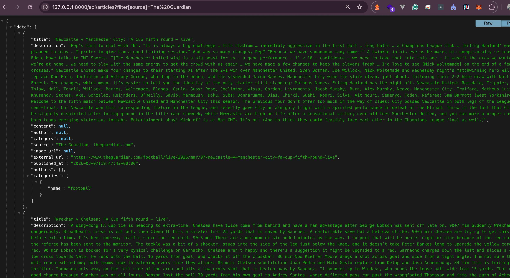

## News aggregator

This repo contains the implementation of a news aggregator.

## Backend Installation & Requirement
Clone the repository and install dependencies 
- Composer:
- Apache or Nginx (server to run the application):
- PHP (requires 8.2 upwards):

```bash
# cd to the file
cd news-api
```
```bash
# Install PHP dependencies
composer install
```

## Environment Configuration

Copy the example environment file and set up the required configurations:

```bash
cp .env.example .env
```

Generate the application key:

```bash
php artisan key:generate
```

Run migration:
```bash
php artisan migrate
```

Run database seeder with a user seeded
```bash
php artisan db:seed
```


To run app 
```bash
#use sail
./vendor/bin/sail up
#or
php artisan serve
```
the app should be available in [http://localhost:8000/](http://127.0.0.1:8000/)

Fetch news from a specific a source
NOTE: If no source is specified, it runs for the configured sources in the NewsSourceServiceProvider
```bash
php artisan fetch:news  --source=NewsAPI
#or "New York Times" or "The Guardian"

```

## Deployment

### Deploying to Production

For production deployment, set up your web server:

```bash
php artisan config:cache
php artisan route:cache
php artisan view:cache

php artisan schedule:work
```

## Run Tests

```bash
php artisan test
```
## To fix PHP code style

```bash
./vendor/bin/pint
./vendor/bin/rector
```

## Architecture & Design Patterns
- I implemented a command that allows pulling articles from different sources. 

This is scheduled every 30 mins
```php
Schedule::command('fetch:news')->everyThirtyMinutes();
```

- In this command I implemented the NewsSources, it implements the singleton approach that allows one instance throughout the entire lifecycle. Inside the NewsSourceServiceProvider. Promotes dependency injection
it implements the singleton

```php
$this->app->singleton(NewsSources::class, function () {
    return new NewsSources(collect([
           //  new NewsApiSource,
           new GuardianSource,
           //new NewYorkTimeSource,
           ])
        );
    });
```

- Each source implements an abstract class NewsAbstract::class and implements an interface to fetch articles from various sources.
- I implemented Data Transfer Objects (DTOs), ArticleDTO, AuthorDTO, CategoryDto to allow data transformation. It extends spatie laravel data. Allows for unification of data promoting Single responsibility Principle (SRP) and encapsulation 
- 
### Sample Request
To retrieve all articles, the endpoint is 
- **Get All Articles**: `GET /api/articles`
```http
  GET /api/articles?filter[title]=live&filter[authors.name]=Jessie&page[number]=1
  ```

-  **Query Parameters**:
   -  `filter[title]`: Filter articles by title.
   - `filter[authors.name]`: Filter articles by author's name.
   - `filter[categories.name]`: Filter articles by category's name.
   - `filter[source]`: Filter articles by source.
   - `filter[published_at]`: Filter articles by published_at.
### Sample response


Submitted by [Abdullahi Abdulkabir]([https://github.com/abdullahiabdulkabir])


